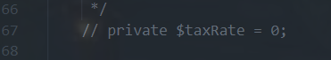

## Xây dựng website thời trang DNTSHOP

## Cách cài đặt
- Tải xuống những thư viện phụ thuộc.
- Sao chép file `.env.example` thành `.env`.
- Tạo khóa ứng dụng `application key` và lưu vào `.env`.
- Chạy các migration để tạo bảng trong cơ sở dữ liệu (Có thể bỏ qua nếu đã có).
- Chạy các migration để tạo bảng trong cơ sở dữ liệu.
- Chạy một máy chủ phát triển tích hợp (development server) cho ứng dụng Laravel.
```
composer install
cp .env.example .env
php artisan key:generate
php artisan migrate
composer dump-autoload
php artisan serve
```
## Xóa cột trong thư viện shoppingcart 
- Truy cập vào đưỡng dẫn
```
/vendor\surfsidemedia\shoppingcart\src\CartItem.php
```
- comment dòng 67 trong file `CartItem.php` bằng cách ấn tổ hợp phím `ctrl` + `/`


## Chức năng cho quản trị viên
1. Dashboard
2. Quản lý người dùng
3. Quản lý banner
4. Quản lý thẻ bài viết
5. Quản lý Bài viết
6. Quản lý bình luận bài viết
7. Quản lý thương hiệu
8. Quản lý danh mục
9. Quản lý sản phẩm (Màu sắc, kích thước, biến thể, hình ảnh)
10. Quản lý mã giảm giá
11. Quản lý và theo dõi đơn hàng
## Chức năng dành cho khách vãng lai
1. Trang chủ
2. Tìm kiếm
3. Xem cửa hàng
4. Xem chi tiết sản phẩm
5. Xem bài viết
6. Xem chi tiết bài viết
7. Liên hệ
8. Giới thiệu
9. Chính sách bảo mật
10. Xem mã khuyến mãi
10. Đăng ký
## Chức năng dành cho người dùng (Đăng nhập)
1. Đăng nhập
2. Quên mật khẩu
3. Đăng xuất
4. Thông tin tài khoản, đổi mật khẩu, lịch sử đơn hàng
5. Đặt hàng, giỏ hàng, thanh toán
6. Đánh giá sản phẩm
7. Bình luận bài viết


